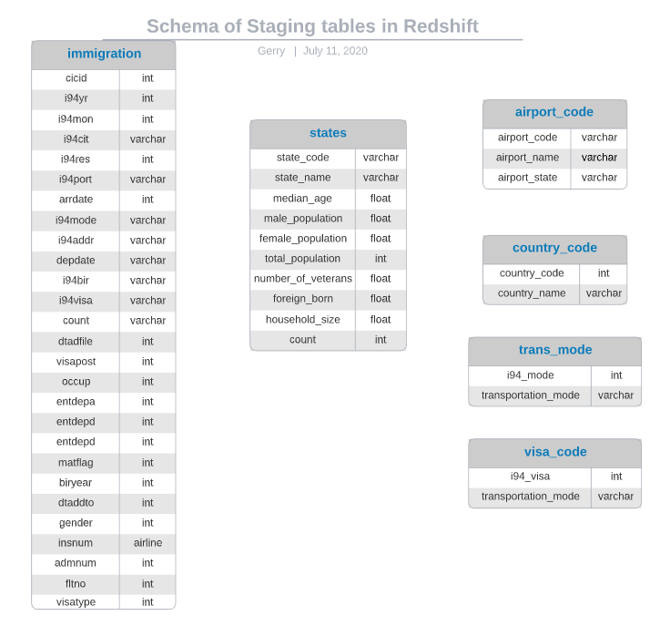
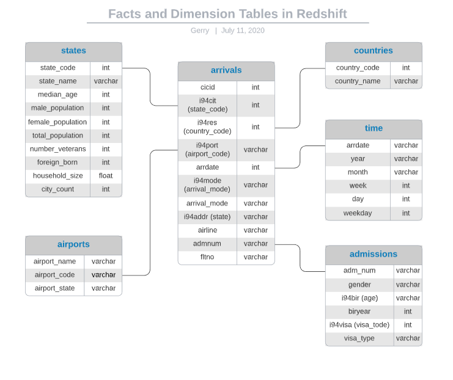
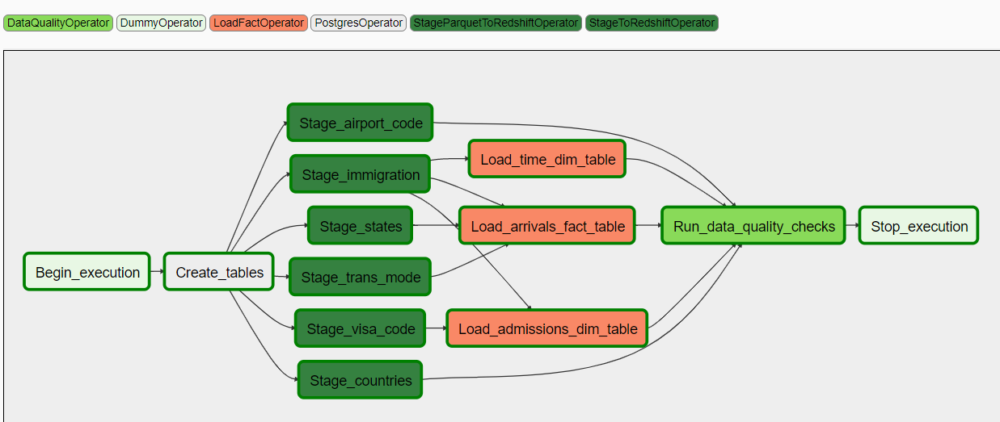
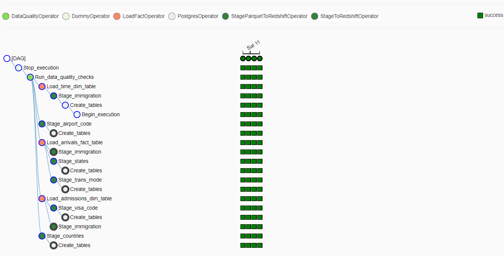

_This is the capstone project of Udacity's Data Engineer Nanodegree program | Completed in July 2020_

# Data Engineering Capstone Project

The goal of the project is to build an ETL pipeline in Airflow to stage, transform, and load data from a S3 repository into a Redshift data warehouse. The schema of the data warehouse is designed to facilitate queries on international arrival into the United States. 

## Datasets used

The datasets used are a list of international arrivals (I-94 forms) into the United States, demographics of cities in the US, and a table of US airport codes:

- **I-94 Immigration Data**: This data comes from the US National Tourism and Trade Office available [here](https://travel.trade.gov/research/reports/i94/historical/2016.html). Each row has detailed international arrival information into the United States including visa type, port of arrival, mode of transportation, country of origin, birth year. 
- **U.S. City Demographic Data**: This dataset contains information about the demographics of US cities. The dataset comes from OpenSoft available [here](https://public.opendatasoft.com/explore/dataset/us-cities-demographics/export/). 
- **Airport Code Table**: This dataset is a table of airport codes and corresponding cities. The airport codes are either three-letter IATA or four-letter ICAO codes. It is available [here](https://datahub.io/core/airport-codes#data).

## Data warehouse schema

After the data is extracted from the respective sources and stored in AWS S3, they are copied to staging tables in Redshift with the following schema:

Then the data is transformed and loaded to a fact table and a set of dimension tables following the Star Schema to facilitate queries on individual arrival:

A data dictionary is available in the notebook [here](project_notebook.ipynb).

## Data Storage

The dataset comes in CSV and Parquet formats and are initially stored in AWS S3. AWS Redshift is chosen to host the relational tables since it has a simple start-up process, good security, is easy to scale up (resize cluster) or scale out (add clusters), and is compatible with S3. 

## ETL pipeline

The process of copying the CSV and parquet data from S3 to Redshift, transforming the data, and loading the data to the final tables are built into an ETL pipeline using Airflow with a daily update schedule . Additionally, a data quality check is performed to ensure that there are no missing values for the primary keys of the tables. 

Here are the graph and tree views of the Airflow DAG:

